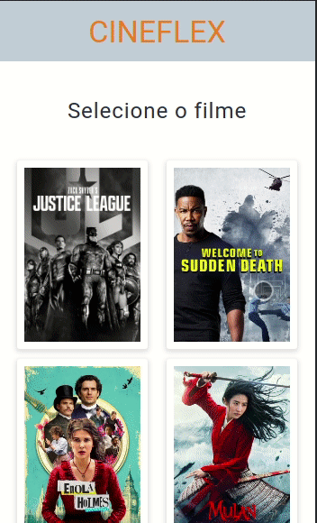

# Cineflex

A movie ticket booking app written in React where you can choose the movie, section and seats, getting your ticket at the end.

## A gif using the app

### Try by your self!

cineflex-plum.vercel.app/

### About this project

This is one of the projects of my personal portfolio, so, any feedback about the project, code or anything that you can report that could make me a better developer will be welcome!

I build this project to test my knowlodge about react, react router, react hooks, styled componentes, but mainly for see how can we use the routing of react-router instead manually routing and to take my first try with more complex process of componentization.

I'll add one more feature in the future: display one input for each seat.

### Tecnologies used

- React
- React-Router
- React Hooks
- Styled Components
- Axios

### To run this project

Install the dependencies with `npm install`, run `npm run start` to run the app, it will be open in http://localhost:3000.
